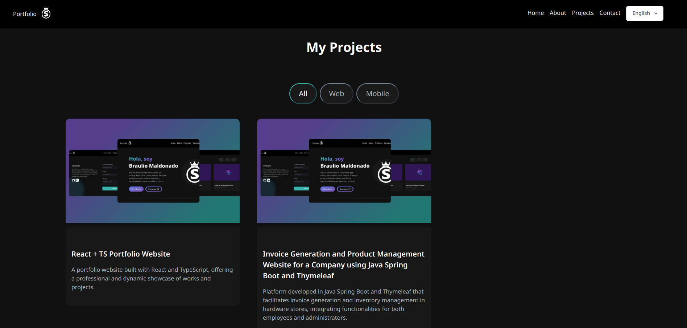

# Portfolio by Braulio Maldonado Casilla

@ShinjiMC - By Braulio Nayap Maldonado Casilla

This portfolio is a personal project created with React, Vite, and TypeScript showcasing my skills, projects, and professional background.

## Technology Stack

- **Framework**: React + Vite
- **Language**: TypeScript
- **Testing**: Vitest, @testing-library
- **Animation**: Framer Motion
- **Internationalization**: i18n
- **Styling**: Sass
- **Email Integration**: @emailjs/browser

## Features

This portfolio is divided into four main sections, each designed to provide a comprehensive overview of my professional capabilities and personal projects.

### Home

The homepage introduces me with a brief overview and a welcoming message.


### About Me

This section contains detailed information about my skills, educational background, and certifications.


### Projects

Here, I present all my projects, providing insights into each project along with links to live sites and source code for further exploration.


### Contact

The contact form allows for easy communication, whether for inquiries, potential contracts, or other professional requests.


## Code Quality and Testing

The project emphasizes high code quality and robust testing, integrating Vitest for unit testing. You can view the project's code quality metrics and test coverage on SonarCloud at the following link:
[View SonarCloud Metrics](https://sonarcloud.io/summary/new_code?id=shinji_portfolio)


## How to Compile

To compile the project locally, run the following command:

```bash
npm run dev
```

## Acknowledgements

This portfolio represents not only my technical skills but also my commitment to quality, usability, and continuous learning. I am excited to share it with you and welcome any feedback or inquiries.

Thank you for visiting my portfolio.

## License:

This project is licensed under [Creative Commons Atribución-NoComercial-CompartirIgual 4.0 Internacional](http://creativecommons.org/licenses/by-nc-sa/4.0/):

<a rel="license" href="http://creativecommons.org/licenses/by-nc-sa/4.0/">
  
</a>
